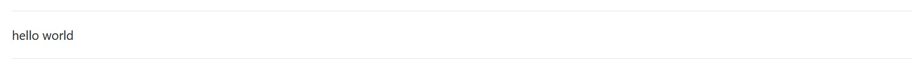
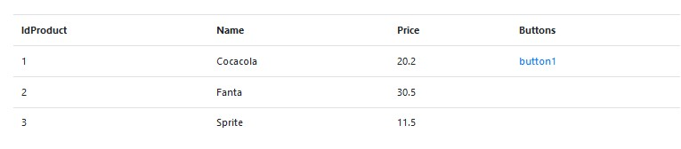

# DashOne
A minimalist dashboard /backend library  for PHP

This library allows to create a fast dashboard with the basic features without any template and only using code.  In the examples, we create a page for a dashboard in less than 80 lines of code ( [examples/test.php](examples/test.php) )

[](https://travis-ci.org/EFTEC/DashOne)
[](https://packagist.org/packages/eftec/dashone)
[](https://packagist.org/packages/eftec/dashone)
[]()
[]()
[]()
[]()
[]()


Example  ( [examples/test.php](examples/test2.php) ):


Another example ( [examples/test.php](examples/test2.php) ):


## Getting started

Install via composer 

> composer require eftec/dashone

Create a new object DashOne (you will need to add the required include, via autoload.php or manually)

> $dash=new DashOne();

And you could render a page using the object of the class DashOne()

```php
use eftec\DashOne\DashOne;
$dash=new DashOne();
$dash->head('Example - test 1'); // it is required
$dash->rawHtml('hello world'); 
$dash->footer(); // it is required
$dash->render(); // it renders an empty page
```

## Classes

### DashOne

It is the main class that generates the dashboard.

> $dash=new DashOne();

It is possible to add new elements using fluent interface (chain methods each one).


Example: It renders an empty page

```php
$dash=new DashOne();

$dash->head('Example - test 1');
$dash->footer();
$dash->render();
```

Example using fluent

```php
$dash=new DashOne();
    ->head('Example - test 1');
    ->footer();
    ->render();
```

Where the method head is required to render the < head > of the page.

The footer is also required to close all the tags.

And every chain of methods must end with the method render() (it draw the page).

```php
// see examples/testuibasic.php
$dash=new DashOne();
$dash->head('Example - test 1')
	->menuUpper(['Upper title'])
	->startcontent()
	->menu($links) // left menu
	->startmain()
	// here it goes the content
	->endmain()
	->endcontent()
	->footer()
	->render();		
```


#### Method DashOne->head($title,$extrahtml)

It renders the head of the page.  This element is required

> $dash->head('Example - test 1');

#### Method DashOne->menuUpper($leftControls=[],$rightControls=[])

It renders the upper menu of the dashboard.

> $dash->menuUpper([new ImageOne('https://via.placeholder.com/32x32')," - ",new LinkOne('Cocacola','#')]);


### AlertOne

It renders an alert

> new AlertOne($title,$content,$class);

Example:

```php
$dash->alert("It is an alert","Content of the alert")

```


```php
$dash->alert("It is an alert","Content of the alert","alert alert-danger")
```


### ButtonOne

It renders a button

> new ButtonOne('button1','Click me','btn btn-primary');

You could use the method buttons (DashOne) to render a button (or buttons).  The method has a second argument to determine if the buttons must be aligned or not with the form.

```php

$buttons=[
	new ButtonOne('button1','Click me','btn btn-primary'),
	new ButtonOne('button2','Click me too','btn btn-danger')
];


$dash->buttons($buttons,false) // where if true then buttons are aligned with the form

```

> $dash->buttons($buttons,true) 


> $dash->buttons($buttons,false)


### ContainerOne

It renders a container where it is possible to add other elements (such as buttons)

> new ContainerOne($html);

Example:

```php
	$dash->container("<div class='form-group row'><div class='col-sm-10 offset-sm-2'>%control</div></div>")
		->buttons($buttons)
```
The method container() but be followed by a visual method. This method is added inside the container (where it says %control)

Another example:

```php
	$dash->container("<hr>%control<hr>")->rawHtml("hello world")
```




### FormOne

It renders a form. It requires a declarative array.

If it sets a definition, then it uses the definition to define the types of input objects (textbox,textarea,etc.)

If a field of the definition has an array then it is used to render a dropdownitem

If it doesn't have a definition then, it uses the values to define the types of input objects (textboxes,textareas,etc.)


You could also render a message (for example for warning or information)
You could draw a form using an associative array. By default, every field will be a textbox

```php
$currentValue=['IdProduct'=>"2"
	,'Name'=>"aaa"
	,'Price'=>"333"
	,'Type'=>1
	,'Description'=>''];

$dash->form($currentValue) // it's macro of new FormOne()
``` 


Or you could explicit the type of field

```php
$definition=['IdProduct'=>'hidden'
	,'Name'=>'text'
	,'Price'=>'text'
	,'Type'=>['cocacola','fanta','sprite']
	,'Description'=>'textarea'];
$currentValue=['IdProduct'=>"2"
	,'Name'=>"aaa"
	,'Price'=>"333"
	,'Type'=>1
	,'Description'=>''];

$dash->form($currentValue,$definition) // it's macro of new FormOne()
``` 


### UlOne

It draws a list (unsorted list)

```php
$valueUL=['Cocacola','Fanta','Sprite'];

$dash->ul($valueUL) // it's macro of new UlOne()
```


### ImageOne

It draws a image

> new ImageOne('https://via.placeholder.com/32x32');


### LinkOne

It draws a hyperlink

The first value is the name of the link, the second is the address. And the third value (optional), it's a icon (using the classes of Font-Awesome)

> new LinkOne('Cocacola','#','far fa-star')
> $dash->link('Cocacola','#','far fa-star')


### TableOne

it renders a table.

```php
$values=
	[
		['IdProduct'=>1,'Name'=>'Cocacola','Price'=>"20.2"],
		['IdProduct'=>2,'Name'=>'Fanta','Price'=>"30.5"],
		['IdProduct'=>3,'Name'=>'Sprite','Price'=>"11.5"],
	];

$dash->table($values)->...  // it must be called after the render
```    




### A basic page :

Any pages requires at least to call the head(), footer() and Render().

Render() draws the page so it must be called at the end of the chain.

For example, a basic page is as follow:


```php
$dash=new DashOne();

$dash->head('Example - test 1');
$dash->footer();
$dash->render();
```

### An empty dashboard:

 
```php
$dash=new DashOne();

$dash->head('Example - test 1');
$dash->menuUpper([new ImageOne('https://via.placeholder.com/32x32')," - ",new LinkOne('Cocacola','#')]);
$dash
	->startcontent() // start the container
		->menu($links) // left menu
		->startmain() // start the main container
			->title('Table of Products')
		->endmain()
	->endcontent();
$dash->footer();
$dash->render();
```


## Version

* 1.4 2020-16-01 
    * new method cssLogin()
    * new method login()
    * new method fetchLogin()
    * new method decrypt()
    * new method encrypt()      
    * new field var $salt='';
    * new field $validateLogin (callable)
    * changes to __construct()
* 1.3 2020-01-15 new method fetchvalue()
* 1.2 2019-03-30 New changes.  
* 1.1 2019-03-17 Fixed some bugs  
* 1.0 2019-03-01 First Version.  


## Copyright

Copyright Jorge Patricio Castro Castillo <jcastro arroba eftec dot cl>
Dual License (LGPL v3 and Commercial License)  

You could use in commercial / close source product or service while  

In a nutshell (it is the license): 

* You must keep the copyright notices.  
* If you modify the library then you must share the changes and modifications.

   


